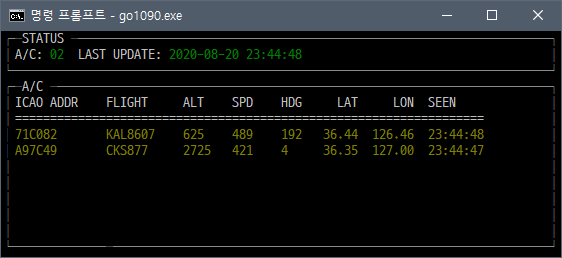

# go1090
Go1090 is a Mode S decoder for RTL-SDR devices.
Go1090은 RTL-SDR을 위한 Mode S 디코더입니다.



The source code of the mode_s directory is the mode S decoder of the [antirez/dump1090](https://github.com/antirez/dump1090) reimplemented in Go.
mode_s 디렉터리의 소스코드는 [antirez/dump1090](https://github.com/antirez/dump1090)의 Mode S 디코더를 Go로 다시 구현하였습니다.

This program does not receive data directly from the RTL-SDR device, it uses the output of rtl_adsb.exe included in the RTL-SDR driver package.
이 프로그램은 RTL-SDR 장치로부터 직접 데이터를 수신하지 않으며, RTL-SDR 드라이버 패키지에 포함된 rtl_adsb.exe의 출력을 사용합니다.

 * Download pre-built windows RTL-SDR driver and softwares include rtl-adsb:
   1. [http://osmocom.org/attachments/2242/RelWithDebInfo.zip](http://osmocom.org/attachments/2242/RelWithDebInfo.zip)
   1. [https://ftp.osmocom.org/binaries/windows/rtl-sdr/](https://ftp.osmocom.org/binaries/windows/rtl-sdr/)

## run
```bash
set PATH=%PATH%;C:\path\to\rtl-sdr

go build
go1090.exe
```

# Todo
 * REST API 추가

# useful links
 * [RTL-SDR Wiki](http://osmocom.org/projects/rtl-sdr/wiki) - Manual of RTL-SDR
 * [RTL-SDR.COM](https://www.rtl-sdr.com/) - Related resources for RTL-SDR
 * [The 1090MHz Riddle](https://mode-s.org/decode/ehs/introduction.html) - An open-access book about decoding Mode-S and ADS-B data.

